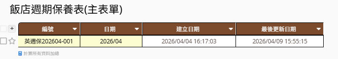
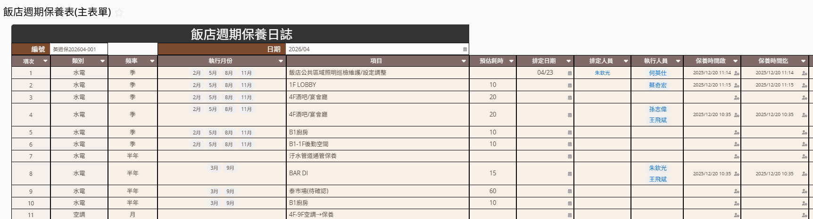

「繼續開發 portal 專案，現在要新增＿＿功能」

## 後端

cd C:\OneDrive\_Ragic\portal\frontend

npm run build

npx vite preview --host 127.0.0.1

## 前端

cd C:\OneDrive\_Ragic\portal\backend>

PS C:\OneDrive\_Ragic\portal\backend> uvicorn app.main:app --reload --port 8000

「繼續開發 portal 專案，現在要新增"1.1 飯店週期保養表""功能」，說明如下：

1. 飯店週期保養表(https://ap12.ragic.com/soutlet001/periodic-maintenance/6?PAGEID=VZG) 是主表單清單，如圖一，點擊後，可以進入每一次的保養表

2. 附圖2，就是點擊後的明細表

3. 原Ragic的設計，以Coding 或是高階主管都很難有最佳的呈現，我想要在Portal上呈現，請給我設計建議

測試區npm run dev

uvicorn app.main:app --reload --port 8000

正式區

npm run build

uvicorn app.main:app --host 127.0.0.1 --port 8000 --workers 2

uvicorn app.main:app --reload --port **8000**

cd portal/frontend

# 安裝依賴（首次）

npm install

# 建置靜態檔

npm run build

# → 產出 dist/ 目錄

# 預覽建置結果（確認用）

npm run preview

npx vite preview --host 127.0.0.1

# → http://localhost:4173

# 正式部署：用 nginx 或任何 web server 指向 dist/ 目錄

